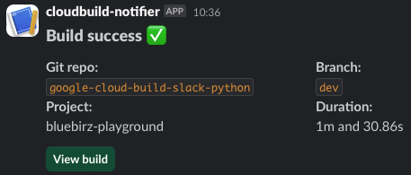
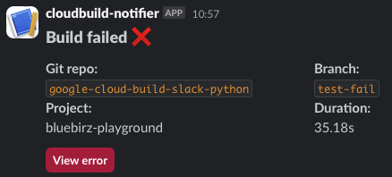

# cloud-events-slack-notification

This is an application to listen to Google Cloud Build events (through pub/sub `cloud-builds`) and send Slack notifications, indicating whether the build is successful or failed.  

## Services involved

- Google Cloud Build
- Google Cloud Pub/Sub (topic `cloud-builds`)
- Google Cloud Functions (this)
- Google Secret Manager (id `slack-webhook-url`)
- Slack API

## Prerequisites

- APIs
  - [Eventarc API](https://console.developers.google.com/apis/api/eventarc.googleapis.com/overview)
  - [Cloud Functions API](https://console.cloud.google.com/apis/api/cloudfunctions.googleapis.com/metrics)
  - [Cloud Run Admin API](https://console.cloud.google.com/apis/api/run.googleapis.com/metrics) because Cloud Functions Gen 2 relies on Cloud Run
- Cloud build service account has roles:
  - Cloud Functions Developer
  - Service Account User
- Cloud Functions service account (or Compute Engine default service account) has roles:
  - Secret Manager Secret Accessor
- [Slack webhook](https://api.slack.com/messaging/webhooks)
- Cloud Secret Manager:
  - having key id `slack-webhook-url` with valid Slack webhook url

## Used Python packages

- `Jinja2` for Slack message template
- `requests` to Slack webhook API
- `human_readable` & `python-dateutil` for formating date time to human-readable format

## Sample Slack messages

### A build is successful

### A build is unsuccessful

## Diagram

